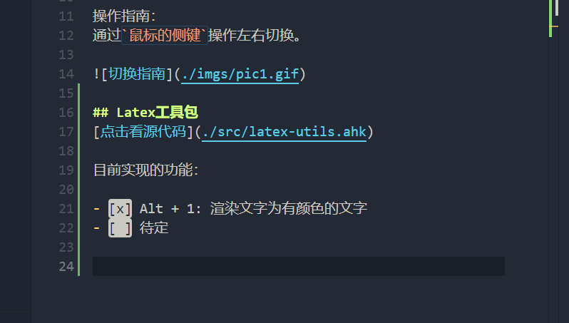

# AHK-Lib

[<a href="./README-EN.md">English</a>] | 中文

我的AutoHotKey库，为了简化操作想了一些脚本。

## 切换虚拟桌面
[点击看源代码](./src/switch-desktop.ahk)

由于雷蛇鼠标驱动没有找到录制 Win快捷键 的，所以写了AHK去操作ctrl + win + 左右去切换虚拟桌面，方便工作桌面的分类和整理

操作指南：
通过`鼠标的侧键`操作左右切换。

## Latex工具包
[点击看源代码](./src/latex-utils.ahk)

目前实现的功能：

- [x] Alt + 1: 渲染文字为有颜色的文字
- [ ] 待定

